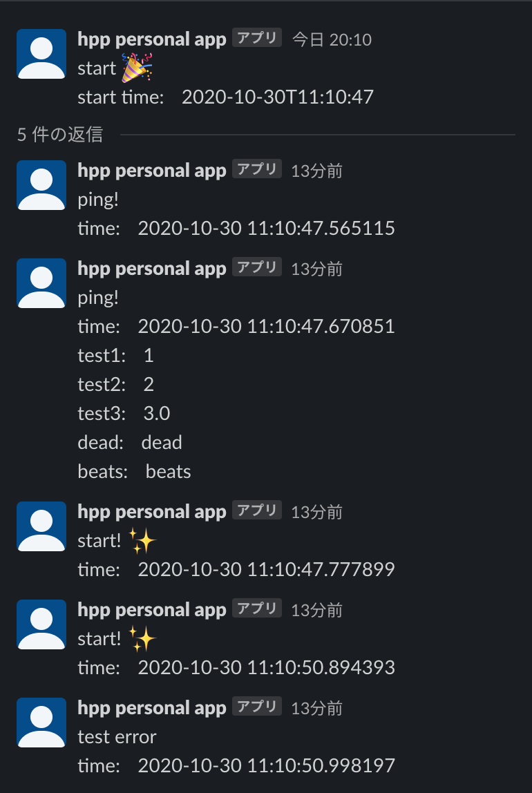

# DEADBEATS

An easy to use Slack messaging library for research.

## Usage

```python
from deadbeats import DEADBEATS
# set environment variables as below
# SLACK_ACCESS_TOKEN=xxxx-xxxxxxxxxxxxx-xxxxxxxxxxxxxx-xxxxxxxxxxxxxxxxxxxxxxxx (Get your own Slack API access token)
# SLACK_CHANNEL_ID=deadbeats (set slack channel id whatever you like!)


# or you can set configurations manually.
DEADBEATS.set_access_token("SLACK_ACCESS_TOKEN")
DEADBEATS.set_channel_id("SLACK_CHANNEL_ID")


# `DEADBEATS.wrap` sends a message at the beginning and end of the function.
# `DEADBEATS.wrap` catch every errors and raise it after sending a error message.
@DEADBEATS.wrap
def main():
    # A simple "heartbeating" message.
    DEADBEATS.ping()


    # Start threading!
    # All subsequent messages will be sent to the thread.
    DEADBEATS.start_thread()


    # You can add extra information like below.
    params = {"loss": 0.5, "val_loss": 1.6, "acc": 100.0}
    DEADBEATS.ping(text="message whatever you like", params=params, additional="info", huga="huga")


    # If you want to stop threading, you can use this method.
    # This method reset "thread_ts" of a instance variable, which is a id of thread.
    DEADBEATS.reset_thread()
```

## With PyTorch Lightning

```python
from deadbeats import DEADBEATS

class MyModel(pl.LightningModule):

    ...

    def on_train_start(self):
        DEADBEATS.start_thread()

    ...

    def validation_epoch_end(self, outputs):
        avg_loss = torch.stack([x['val_loss'] for x in outputs]).mean()

        DEADBEATS.ping(val_loss = avg_loss, current_epoch = self.current_epoch)

        return {'val_loss': avg_loss}

    ...

    # custom training function
    @DEADBEATS.wrap
    def fit(self, trainer):
        trainer.fit(self)

```


## messages like below




This library is named after the wonderful work of [Mori Calliope](https://www.youtube.com/channel/UCL_qhgtOy0dy1Agp8vkySQg), [DEAD BEATS](https://youtu.be/6ydgEipkUEU), and inspired by [hugginface/knockknock](https://github.com/huggingface/knockknock).

